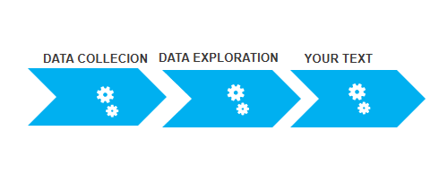

<html>

<body>
<h1>Olympics Data Analysis</h1>

The modern Olympic Games or Olympics are leading international sports events featuring summer and winter sports competitions in which thousands of athletes from around the world participate in a variety of competitions. The Olympic Games are considered the world’s foremost sports competition with more than 200 nations participating.

The total number of events in the Olympics is 339 in 33 sports. And for every event there are winners. Therefore various data is generated. So, by using Python we will analyze this data.

Modules Used
Pandas: It is used for analyzing the data,
NumPy: NumPy is a general-purpose array-processing package.
Matplotlib: It is a numerical mathematics extension NumPy
seaborn: It is used for visualization statistical graphics plotting in Python

<h1>Libraries Used: </h1>
<ul>
<li>Numpy</li>
<li>Pandas</li>
<li>Matplotlib</li>
<li>plotly</li>
<li>Streamlit</li>
<li>seaborn</li>
</ul>
<h1><b>WorkFlow</b></h1>

<ol>
<li>Data Collection</li>
<li>Exploratory Data Analysis</li>
<li>Data Cleaning</li>
<li>Model Tally</li>
</ol>
<ol><li>Medal Tally</li><li>Overall Analysis</li><li>Countrywise Analysis</li><li>Athletewise Analysis</li>
</ol>
<h1>Project Overview</h1>
<h1>Medal Tally</h1>

<h1>Overall Analysis</h1>

<h1>Countrywise  Analysis</h1>

<h1>Athletewise Analysis</h1>

<video width="320" height="240" controls src="./files/Olympics Analysis.mp4">
  <source src="./files/Olympics Analysis.mp4" type="video/mp4">
Video: 
</video>
<a href="https://olympicsdataanalytics.herokuapp.com/">Livelink</a>
<a href="https://www.kaggle.com/datasets/heesoo37/120-years-of-olympic-history-athletes-and-results">Dataset</a>
</body>

</html>
