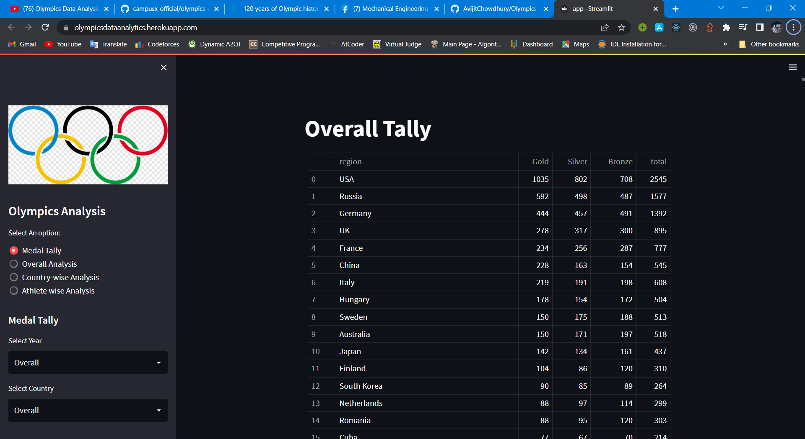
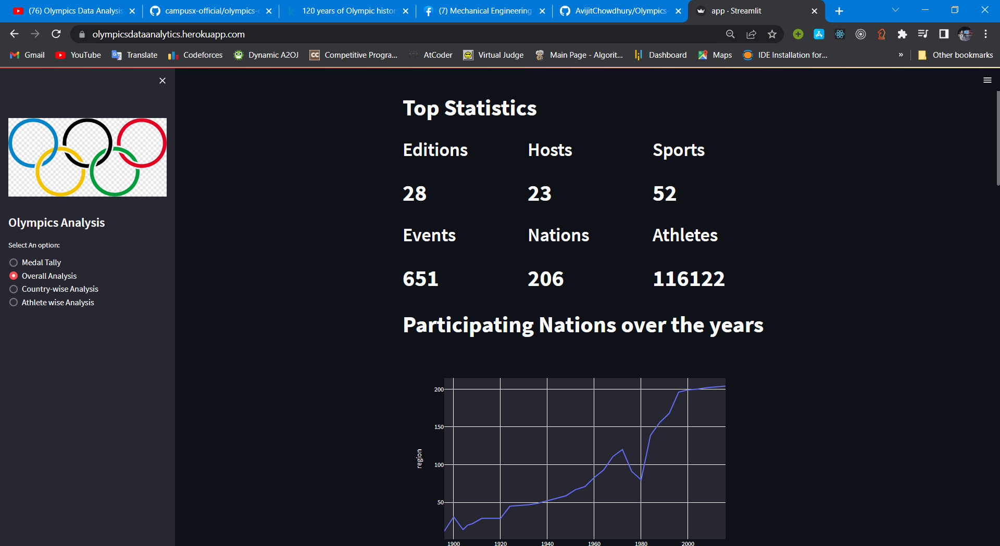
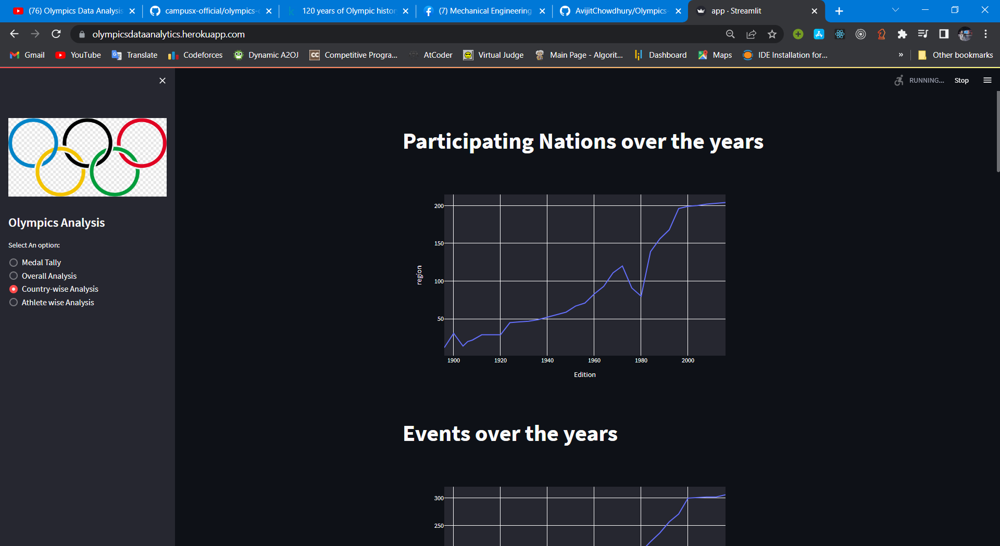
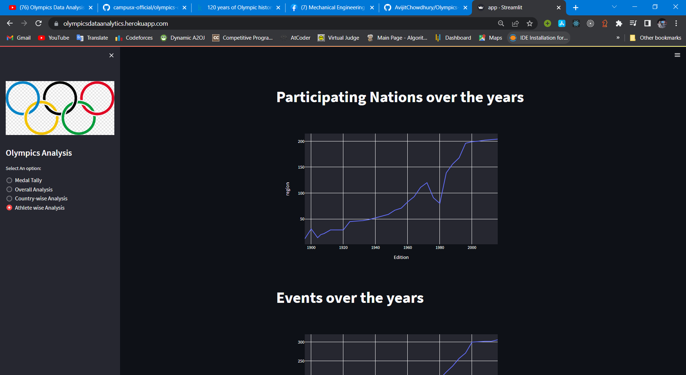

<html>

<body>
<h1>Olympics Data Analysis</h1>

.

<h1>Libraries Used: </h1>
<ul>
<li>Numpy</li>
<li>Pandas</li>
<li>Matplotlib</li>
<li>plotly</li>
<li>Streamlit</li>
<li>seaborn</li>
</ul>
<h1><b>WorkFlow</b></h1>

<ol>
<li>Data Collection</li>
<li>Exploratory Data Analysis</li>
<li>Data Cleaning</li>
<li>Model Tally</li>
</ol>
<ol><li>Medal Tally</li><li>Overall Analysis</li><li>Countrywise Analysis</li><li>Athletewise Analysis</li>
</ol>
<h1>Project Overview</h1>
<h1>Medal Tally</h1>

<h1>Overall Analysis</h1>

<h1>Countrywise  Analysis</h1>

<h1>Athletewise Analysis</h1>

<video width="320" height="240" controls src="./files/Olympics Analysis.mp4">
  <source src="./files/Olympics Analysis.mp4" type="video/mp4">
Video: 
</video>
<a href="https://olympicsdataanalytics.herokuapp.com/">Livelink</a>
<a href="https://www.kaggle.com/datasets/heesoo37/120-years-of-olympic-history-athletes-and-results">Dataset</a>
</body>

</html>
